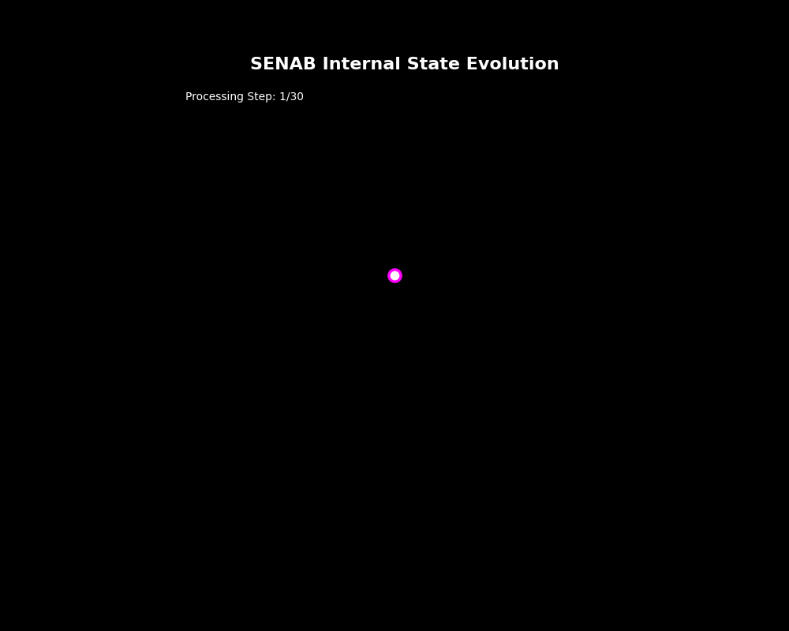
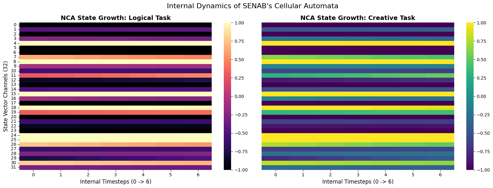
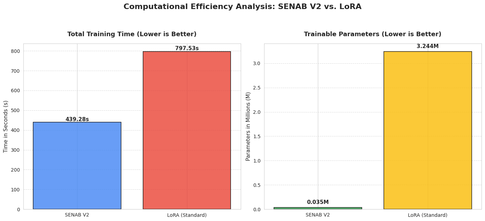
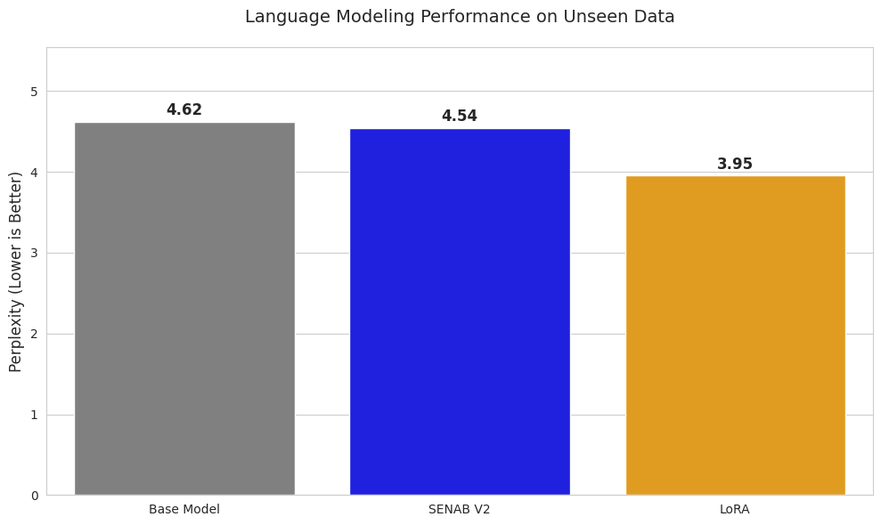
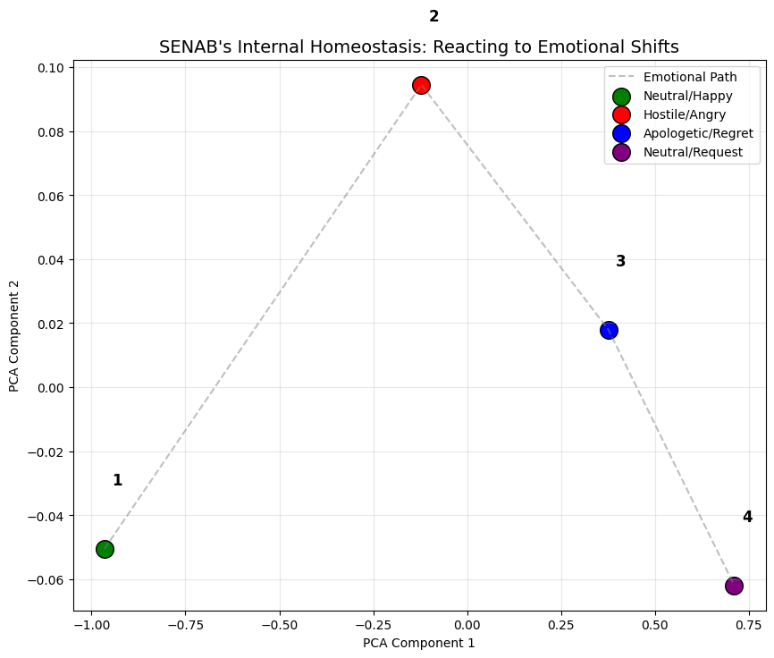
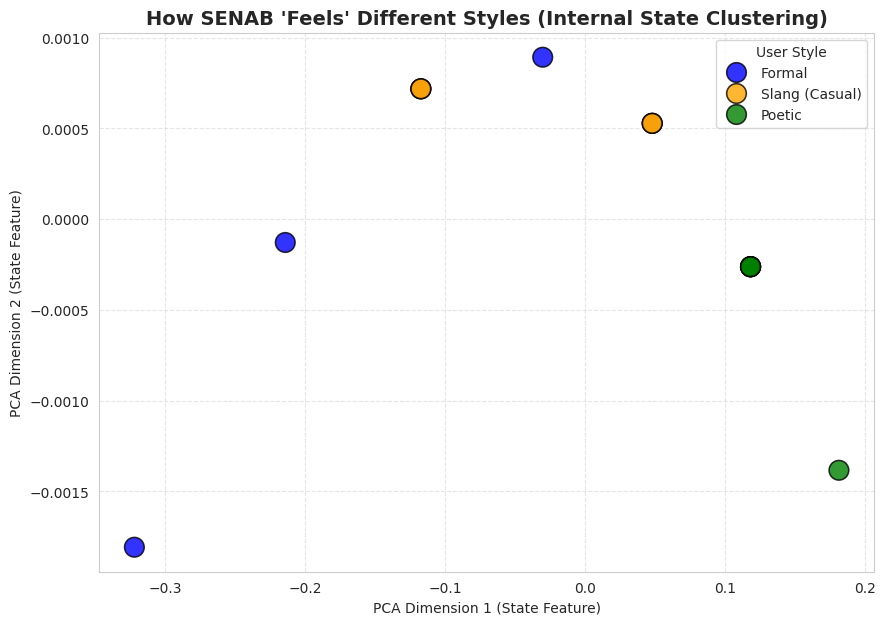

# SENAB: Dynamic Contextual Adaptation in LLMs via Neural Cellular Automata Bridges
<p align="center">
  
</p>

<div align="center">

[](https://colab.research.google.com/github/alisakour/SENAB/blob/main/notebooks/SENAB_Experiment.ipynb)
[](https://opensource.org/licenses/MIT)
[](https://pytorch.org/)

**Official implementation of the SENAB architecture: a neuro-symbolic bridge for Large Language Models.**

</div>

---

## 🌟 Abstract

**SENAB (Self-Evolving Neural Automata Bridge)** challenges the static nature of standard parameter-efficient fine-tuning (PEFT) methods such as LoRA.  
By embedding a dynamic **Neural Cellular Automata (NCA)** controller into *frozen Transformer blocks*, SENAB enables the model to **evolve its internal state during the forward pass**.

This approach achieves **extreme parameter efficiency**, **real-time contextual adaptation**, and **emergent behavioral plasticity** without modifying the base model weights.

---

## 🚀 Key Highlights

- **98.9% Parameter Reduction**  
  Only **0.035M** trainable parameters vs **3.24M** for LoRA (Rank 32).

- **45% Faster Convergence**  
  Optimized for low-data regimes and rapid training.

- **Dynamic Plasticity**  
  Superior linguistic diversity (**Distinct-2: 0.99**) and emotional homeostasis.

---

## 🏗️ Architecture Visualization



*Figure 1: Internal dynamics — visualization of NCA state growth across internal timesteps.*

---

## 📊 Benchmarks (TinyLlama-1.1B)

| Method | Trainable Parameters | Training Time | Distinct-2 |
|------|----------------------|---------------|------------|
| LoRA (Rank 32) | 3.24M | 797.53 s | 0.925 |
| **SENAB (Ours)** | **0.035M** | **439.28 s** | **0.995** |

<p align="center">
  
  
</p>

---

## 🧪 Thought Trajectory & Homeostasis



*Figure 2: Emotional homeostasis — SENAB reacts to affective shifts while preserving interaction memory.*



*Figure 3: Semantic style clustering — mapping intent (Formal, Poetic, Slang) into structured latent regions.*

---

## 🛠️ Quick Start

### Option 1: Google Colab (Recommended)

Click the **Open in Colab** badge at the top of this page to run the experiment directly in your browser.

### Option 2: Local Installation

```bash
git clone https://github.com/alisakour/SENAB.git
cd SENAB
pip install -r requirements.txt
jupyter notebook notebooks/SENAB_Experiment.ipynb
```

---

## 📜 Citation

If you use this work in your research, please cite:

```bibtex
@article{sakour2026senab,
  title   = {SENAB: Dynamic Contextual Adaptation in LLMs via Neural Cellular Automata Bridges},
  author  = {Sakour, Ali},
  year    = {2026},
  journal = {Pre-print}
}
```

---

## 📄 License

This project is licensed under the **MIT License**.

<p align="center">
Built for the future of adaptive AI by <b>Ali Sakour</b>
</p>
